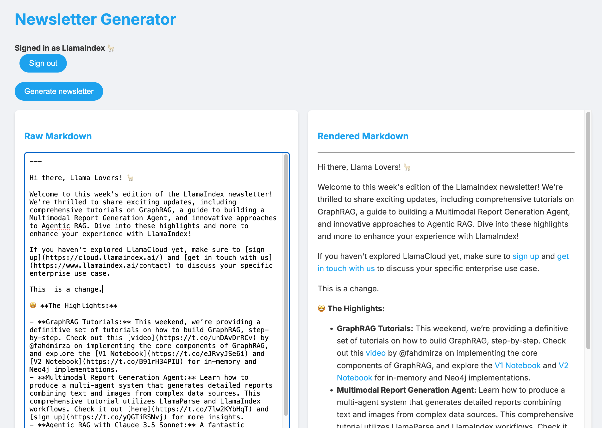

# Newsletter Generator

## We make a lot of content

At LlamaIndex we [tweet a lot](https://x.com/llama_index). We put quite a lot of effort into these tweets: we carefully create content, or curate it from the community, and we link to it with carefully-crafted summaries highlighting what's interesting about it, what you'll learn, and why it's important to our audience of AI Engineers. Each tweet takes between 30-60 minutes to write, mostly the time it takes to read the underlying content and ferret out the important parts.

## We put it in our newsletter

But tweets are fleeting, and it's easy to miss them. So every week we publish a newsletter, and the newsletter is basically a summary of what we tweeted, roughly categorized by topic. The newsletter is very popular -- something like 30,000 people subscribe to it, of whom about 40% open it every week, which is really high for a newsletter that goes out so often.

## Writing the newsletter is a lot of work

But unlike the tweets, crafting the newsletter is pretty mechanical: you just scroll back through the tweets, rephrase them, and put them in the right section. It's a bit of a slog, but it's not hard. It's just time-consuming -- it can take a couple of hours.

## Can AI help?

So I thought: this seems like something AI can help with. Reading information, summarizing it, transforming it? It's a process that requires no creativity. This is the kind of thing AI is good at!

## The result: Newsletter Generator

And this is the result: a web app (open source, of course!) that helps us craft our newsletter. You can see it in action in this 90-second video:

## What it does:

* Logs in with our Twitter account (and only ours)
* Loads the last week's worth of tweets
* Finds the most popular ones (as measured by likes)
  * These become the highlights of the week
* Groups the rest by topic
  * Stuff about our paid products, LlamaCloud and LlamaParse
  * Changes to the LlamaIndex framework itself
  * Interesting stuff from the community
* It pulls content and links out of the tweets and summarizes each one
* It generates a markdown draft of the newsletter
* It lets us edit the draft, because it doesn't always get it right

## How it works

**Caution: nitty gritty technical details, probably only web developers care.**

This is a full-stack Next.js application using [LlamaIndex.TS](https://ts.llamaindex.ai/), the TypeScript version of LlamaIndex. It's deployed on Vercel's serverless platform. There are several tricky parts that I'm noting here to help others attempting to build similar apps:

* **next.config.mjs**: There are two vitally important lines necessary to make LlamaIndex work in Vercel's serverless environment:
  * `serverComponentsExternalPackages: ['sharp', 'onnxruntime-node']`
    * I wish I could tell you why Vercel needs this, but I don't. There error I was getting was `- error ./node_modules/onnxruntime-node/bin/napi-v3/darwin/arm64/onnxruntime_binding.node Module parse failed: Unexpected character '�' (1:0)` and [this helpful issue](https://github.com/xenova/transformers.js/issues/210) pointed me to what I needed to do.
  * `outputFileTracingIncludes: { "/api/*": ["./node_modules/**/*.wasm"], }`
    * This one I understand a bit better: Vercel attempts to optimize bundle sizes by excluding code that doesn't run, and it gets it wrong sometimes. This adds an override that forces it to include a missing `tiktoken_bg.wasm` file that LlamaIndex needs. Thanks to [this issue](https://github.com/orgs/vercel/discussions/1278) for the pointer.
* **Twitter auth**: I'm using [next-auth](https://next-auth.js.org/) to help with the vagaries of Twitter's OAuth 2.0 login flow, but it's still quite the pain to get right. I used [Claude](https://claude.ai/) a lot to help me put this together, because the docs are spartan. The key file is [src/app/api/auth/\[...nextauth\]/route.ts](src/app/api/auth/\[...nextauth\]/route.ts) which does all the tedious JWT token wrangling necessary to get Twitter to give you the bearer token you need to make API calls. This is also where we configure the app to only let you log in as our Twitter account, because otherwise you could use up a lot of our OpenAI API credits playing with it.
* **Frontend**: mostly a [vanilla React application](src/app/page.tsx), though to handle streaming responses from the API I'm using an `EventSource` which is worth looking at if you've not used it before. Markdown rendering is handled by the excellent [markdown-it](https://markdown-it.github.io/) package.
* **API**: the real [meat of this app](src/app/api/twitter/route.js).
  * First, an extensive one-shot example of a previous, human-written newsletter. This is where the AI gets the pattern of what the newsletter should look like. It's really good at copying our house style!
  * Then we fetch all the tweets from the last 10 days (we do more than a week to account for the newsletter being written on Tuesdays, so we don't want to miss anything). There's some subtleties here, mostly around Twitter stuff like need to specify `fields` to get more than just tweet text, in particular the undocumented `note_tweet` field which contains the text of tweets that go over 280 characters, as nearly all of ours do.
  * We sort the tweets by their public likes and pick the top 3 as highlights
  * We have an honestly pretty short prompt about what to do. Nearly all of the instructions about how to format this newsletter are implicit in the example newsletter we gave it, so we're just emphasizing a few points.
  * Then we stream the response. This was a real pain to get right, getting the headers correct and making sure the LLM and the `complete` method are both set to stream, but works flawlessly once you do.

## What's next

There are some improvements I'm considering, like following the links themselves and reading the content to be able to better describe the content, and to search the web for people's names to be able to link to them directly, but I'm really happy with this as-is. It's not enough to totally automate our newsletter but it will take the time necessary down from hours to minutes.

Plus the whole thing is open source! Feel free to copy anything out of this you find helpful.
